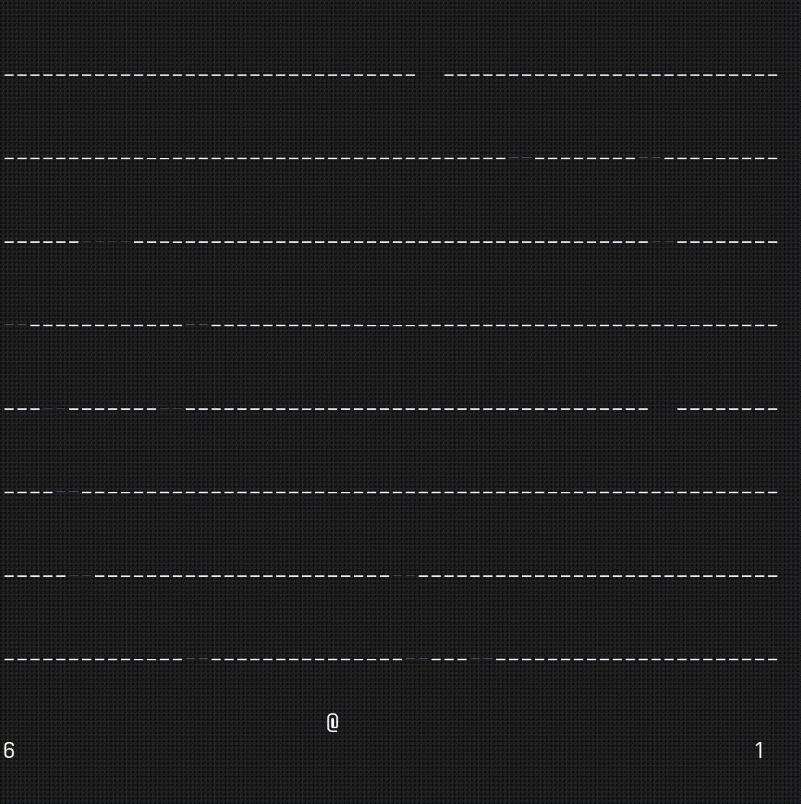

This is a simple recreation of the old video game Jumpick Jack.

To lauch just clone this repo and run `python main.py`

You can see what level you are on in the bottom right. And your lives are display on the bottom left. 

If you want to change the game speed just edit `self.time_holes` on line `45` in `main.py`

